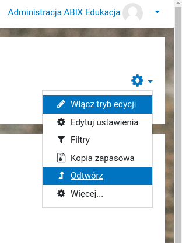
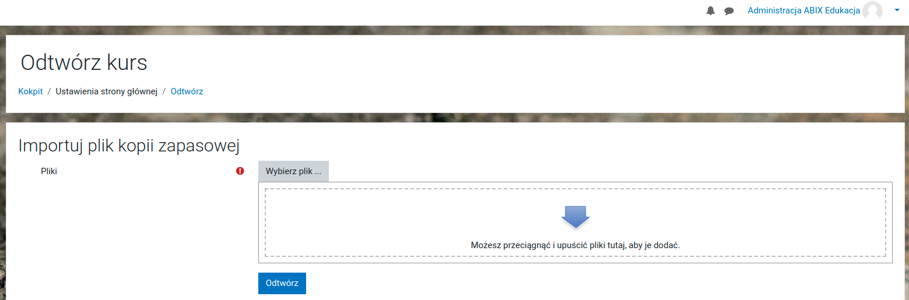

# Dokumentacja paczki do Moodle

---

Paczka została wyeksportowana z Moodle 3.10.2+ (Build: 20210319) (2020110902.02) - rekomendujemy przynajmniej taką wersję. 

Plik: `programujemy-moodle.mbz` - prosimy pobrać i zapisać w katalogu na dysku lokalnym.

Procedura instalacji:

* Logujemy się do naszej instancji Moodle jako administrator
* Na stronie główne w narzędziach wybieramy opcję: `Odtwórz`



* Wybieramy plik i postępujemy wg dalszych komunikatów naszego środowiska.



---

W razie potrzeby prosimy o kontakt:

```
Adam Jurkiewicz
adam (at) jurkiewicz (dot) tech
```
